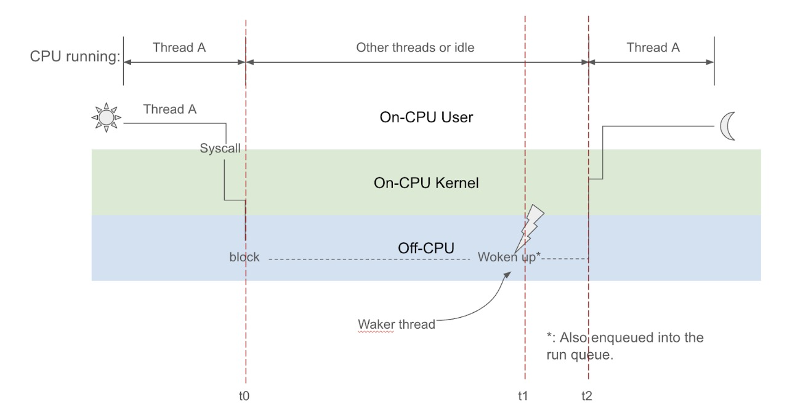
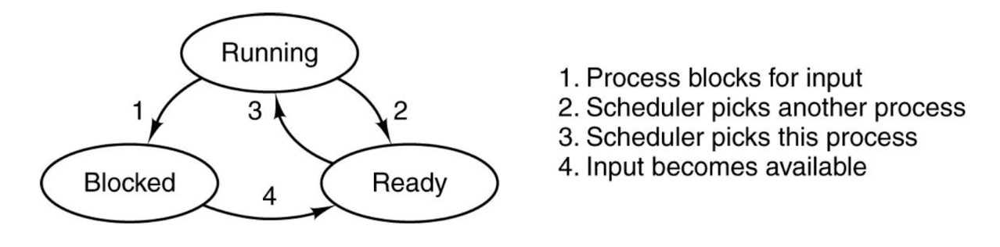

# Problem - Off-CPU/Blocked time analysis
Homework inspired by https://www.brendangregg.com/offcpuanalysis.html

<div align="center">


*Figure 1. Illustration of blocked and off-CPU time.*

</div>


In this exercise,  you are going to shed some light on the internal scheduling of Linux and understand the intrinsic differences between different workloads (I/O heavy or computation-heavy, multi-threaded setting vs single-threaded setting…).  You will be developing using libbpf, as covered in the tutorial class.

The interface of your program should be defined like this:

- A mandatory time interval, which determines how often you print out the histogram (in seconds)
- An optional PID, which determines the process ID of the process you want to trace. If not supplied, then trace all the possible processes. (A better way is to implement per-cgroup tracing, but for simplicity, we don’t have to do it here.)

```bash
make
sudo ./executable_name --time_interval <value> [--pid <value>]
```

<div align="center">


*Figure 2. State Transition Diagram of Processes*
</div>

The output of the program should be 2 histograms:

- Off-CPU Time Histogram: This histogram shows the time a thread spends not running on any CPU. It represents the duration between when the thread stops running (t0 in Figure 1) and when it starts running again (t2 in Figure 1). In other words, it captures the time from one transition out of the running state to the next transition back into the running state (as shown in Figure 2).
- Blocked Time Histogram: This histogram shows the time it takes for a blocked thread to be woken up and placed back into the run queue. It represents the duration between when the thread is blocked (t0 in Figure 1) and when it is re-enqueued into the run queue (t1 in Figure 1). Essentially, it measures the time the thread spends in the blocked state (depicted in Figure 2).

The output histogram should look something like this: (only the format, the distribution will largely depend on what is your workload.)

```bash
Off-cpu time histogram
     usecs               : count    distribution
         0 -> 1          : 0        |                                        |
         2 -> 3          : 0        |                                        |
         4 -> 7          : 47       |************************************    |
         8 -> 15         : 48       |************************************    |
        16 -> 31         : 41       |*******************************         |
        32 -> 63         : 32       |************************                |
        64 -> 127        : 52       |****************************************|
       128 -> 255        : 22       |****************                        |
       256 -> 511        : 16       |************                            |
       512 -> 1023       : 7        |*****                                   |
      1024 -> 2047       : 30       |***********************                 |
      2048 -> 4095       : 27       |********************                    |
      4096 -> 8191       : 25       |*******************                     |
      8192 -> 16383      : 4        |***                                     |
     16384 -> 32767      : 9        |******                                  |
     32768 -> 65535      : 19       |**************                          |
     65536 -> 131071     : 5        |***                                     |
    131072 -> 262143     : 25       |*******************                     |
    262144 -> 524287     : 21       |****************                        |
    524288 -> 1048575    : 15       |***********                             |
   1048576 -> 2097151    : 7        |*****                                   |
   2097152 -> 4194303    : 50       |**************************************  |

Blocked time histogram
     usecs               : count    distribution
         0 -> 1          : 0        |                                        |
         2 -> 3          : 0        |                                        |
         4 -> 7          : 10       |*********                               |
         8 -> 15         : 15       |*************                           |
        16 -> 31         : 19       |*****************                       |
        32 -> 63         : 4        |***                                     |
        64 -> 127        : 2        |*                                       |
       128 -> 255        : 8        |*******                                 |
       256 -> 511        : 4        |***                                     |
       512 -> 1023       : 0        |                                        |
      1024 -> 2047       : 24       |*********************                   |
      2048 -> 4095       : 17       |***************                         |
      4096 -> 8191       : 24       |*********************                   |
      8192 -> 16383      : 5        |****                                    |
     16384 -> 32767      : 9        |********                                |
     32768 -> 65535      : 16       |**************                          |
     65536 -> 131071     : 6        |*****                                   |
    131072 -> 262143     : 25       |**********************                  |
    262144 -> 524287     : 20       |******************                      |
    524288 -> 1048575    : 17       |***************                         |
   1048576 -> 2097151    : 7        |******                                  |
   2097152 -> 4194303    : 44       |****************************************|
```

Let’s break it down:

- Each row is a latency bucket. For example, the first row is for requests with latencies 0-1 us, the second for latencies 2-3us, and so on… (The bucket size is for your own choosing, but a log2 scale is preferred)
- The first column is the bucket range. The second column is the bucket count, how many requests have latencies in that range. The third column is a visualization of the distribution. The proportion is the count for that bucket over the total number of counts in all buckets.

The output should be printed regularly (every x seconds) and only include entries that are completed during that time.

Run different workloads and compare the results of the histogram. Also, create a README.md file describing one interesting workload you’ve tested with the eBPF program. For example, some comparisons could be:

- Running a CPU-heavy workload and an I/O-heavy workload, compare their differences in the 2 histograms.
- Running the same workload with different numbers of threads
- Concurrently running different workloads (some performing IO, some performing computation…), and comparing different proportions of the workload (20% computation + 80% IO v.s. 20% IO + 80% computation, for example)

# Environment

Please use Debian 12 to develop your homework. The recommended way is to run a VM on your laptop. The recommended way is to use VMWare Fusion (there’s a free student license).

WARNING: Running a Debian container is not enough! The kernel is the same as the underlying machine.

Deliverables

- eBPF program
- Userspace loader that prints the distribution every x seconds
- README file describing an interesting use case

I should be able to run your program like so:

```bash
make
sudo ./executable_name --time_interval <value> [--pid <value>]
```

If you have a better idea for the interface design, you can make changes, but make sure to specify them in the readme file. The minimum requirement is to be able to do per-process tracing.

# Hints

- Start by thinking about what kind of map you want. How many kinds of maps do you need? For each of them do you want a per-CPU map or a global map?
- Remember you need bpf-helpers to interact with map (bpf_map_lookup_elem, for example) or kernel data structures (bpf_core_read, for example)
- You need to look into trace points related to scheduling. See the list of scheduling tracepoints in Linux: https://elixir.bootlin.com/linux/v6.11/source/include/trace/events/sched.h to an external site.. Also, if you want to understand what arguments are passed into the eBPF program attached to the tracepoint, pay attention to the fields defined with macro TO_PROTO and TP_ARGS
- You can generate IO requests with [fio](https://arc.net/l/quote/osqvlvyt) You can generate CPU-heavy requests and IO with sysbenchLinks to an external site..
- The pid in the userspace corresponds to tgid (thread group ID) in the kernel task_struct. The tid in the userspace corresponds to the pid in the kernel task_struct. The --pid flag option is meant to be the pid in the user space, So we’re actually tracing a whole thread group here. For example, if you run sysbench cpu with 256 threads, all of them will have the same pid but different tid, and we want to trace all of them if we input their pid to the ebpf program.
- A very similar but different example is https://github.com/iovisor/bcc/blob/master/libbpf-tools/runqlat.bpf.cLinks to an external site.. You can refer to it with map designs, histogram designs, and so on.


Interesting workload:

The following is the output of my histogram after running the startup process of the LLM inference server I use for my research [link](https://github.com/ng4567/HarvestMoE). I waited till the part where the weights were being copied into the GPU's memory. I waited till the weights were transferring for about a minute (it usually takes about 20 minutes to load the model) so that I could make sure the bulk of the data was attributable to my workload. The only other workloads running on the system were the ssh daemon, standard linux proccesses and the cpu-analyzer eBPF program. This is also the all proces histogram, not the individual process histogram, and all work was done on an Azure NC80adis H100 v5 VM, with 80 CPU cores and 2 H100 GPUs.

```bash
Off-cpu time histogram
     usecs               : count    distribution
          0 -> 1          : 6097     |                                        |
          2 -> 3          : 7722     |                                        |
          4 -> 7          : 2241195  |****************************************|
          8 -> 15         : 1942252  |***********************************     |
         16 -> 31         : 26094    |                                        |
         32 -> 63         : 5892     |                                        |
         64 -> 127        : 3443     |                                        |
        128 -> 255        : 1155     |                                        |
        256 -> 511        : 1639     |                                        |
        512 -> 1023       : 2084     |                                        |
       1024 -> 2047       : 2154     |                                        |
       2048 -> 4095       : 13858    |                                        |
       4096 -> 8191       : 2617     |                                        |
       8192 -> 16383      : 1075     |                                        |
      16384 -> 32767      : 1140     |                                        |
      32768 -> 65535      : 3181     |                                        |
      65536 -> 131071     : 4997     |                                        |
     131072 -> 262143     : 10496    |                                        |
     262144 -> 524287     : 5660     |                                        |
     524288 -> 1048575    : 2270     |                                        |
    1048576 -> 2097151    : 1825     |                                        |
    2097152 -> 4194303    : 1201     |                                        |
    4194303 -> infinity   : 121      |                                        |
Blocked time histogram
     usecs                : count    distribution
          0 -> 1          : 0        |                                        |
          2 -> 3          : 87       |                                        |
          4 -> 7          : 2019657  |****************************************|
          8 -> 15         : 68916    |*                                       |
         16 -> 31         : 10696    |                                        |
         32 -> 63         : 2467     |                                        |
         64 -> 127        : 1407     |                                        |
        128 -> 255        : 1092     |                                        |
        256 -> 511        : 1637     |                                        |
        512 -> 1023       : 2065     |                                        |
       1024 -> 2047       : 2103     |                                        |
       2048 -> 4095       : 13846    |                                        |
       4096 -> 8191       : 2602     |                                        |
       8192 -> 16383      : 1075     |                                        |
      16384 -> 32767      : 1138     |                                        |
      32768 -> 65535      : 3181     |                                        |
      65536 -> 131071     : 4997     |                                        |
     131072 -> 262143     : 10496    |                                        |
     262144 -> 524287     : 5660     |                                        |
     524288 -> 1048575    : 2270     |                                        |
    1048576 -> 2097151    : 1824     |                                        |
    2097152 -> 4194303    : 1201     |                                        |
    4194303 -> infinity   : 120      |                                        |
```

I chose this workload because I thought it would involve a lot of IO and a lot of concurrent copying from DRAM to the GPU over PCIE lanes. The histograms make sense since LLM weights loading is an IO bound workload bounded by the speed of the PCIE interface. We see that the histograms are nearly identical. Threads are likely off CPU because they are blocked waiting for IO, not because they're getting prempted or voluntarily yielding. The full output (every 5 seconds can be gound in logs-moe.txt).

Citation:

The uthash C library is not mine and downloaded from: https://github.com/troydhanson/uthash/blob/master/src/uthash.h
